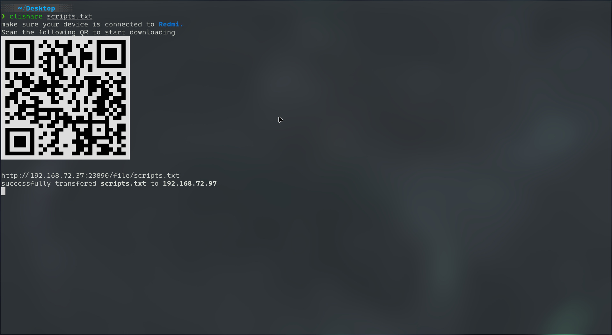
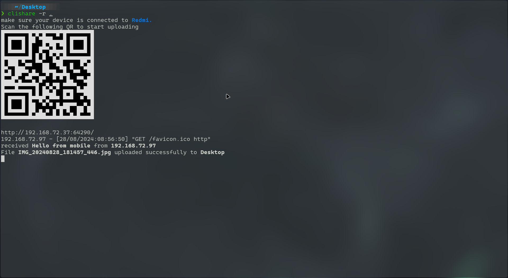

# Cli-Share

**Cli-Share** is a command-line tool for sharing files and messages between devices on the same local network without leaving the CLI. Users can transfer files by simply scanning a QR code or visiting the address displayed in the CLI. The app supports both file and message sharing between a host (the one running the CLI) and clients (those who scan the QR code or visit the provided address).

## Demo




## Features

- **File Sharing**: Share files from the host to clients over the same local network.
- **Message Passing**: Send and receive messages between the host and clients.
- **Folder Sharing**: Automatically zip folders before sending them to clients.
- **Client Uploads**: Clients can upload files or send messages back to the host via the web interface.
- **QR Code Scanning**: Clients can easily access the shared files or message interface by scanning a QR code.

## Constraints

- **Local Network Requirement**: Both the host and clients must be on the same local network.
- **Firewall Settings**: The host must expose their local IP by disabling any firewall settings that could block access.
- **Zipped Folders**: When sharing folders, the content is zipped before being sent to clients.

## Installation

To install **Cli-Share**, use npm:

```bash
npm install -g @jignesh119/cli-share
```

## Usage

```
cli-share - CLI tool to share files between devices in a local network without leaving the CLI.

Usage:
  - Message Passing: cli-share [--message MESSAGE]
    $ cli-share --message,-m MESSAGE

  - File Sharing: cli-share [option {value}] <path>
    $ cli-share /path/to/file || /path/to/folder
    $ cli-share --receive,-r /path/to/receive/file/to
    $ cli-share --port,-p PORT
    $ cli-share --ip,-i IP_ADDRESS
    $ cli-share --help
    $ cli-share --version

Options:
  -r --receive   Enable upload mode, the given path is used to store received files (defaults to current working directory).
  -p --port      Use a custom port for the server; ensure the port is between 1024 and 65535 to avoid conflicts.
  -i --ip        Bind the web server to a custom IP; the IP must be accessible within the subnet.
  -m --message   Send a message to the client.
  -h --help      Show this screen.
  -v --version   Show the version.

Examples:
  $ cli-share ./assets.pdf
  $ cli-share one.txt -p 4000 --ip 192.168.1.10
  $ cli-share sampleFolder
  $ cli-share --receive ./Downloads
  $ cli-share -r
  $ cli-share -r ./Downloads -p 5000 -i 192.168.200.23
  $ cli-share -m "I love cli"
  $ cli-share --message "messaging..." -p 4000 -i 192.168.12.24
```

## Inspiration

This project is inspired by [qrcp](https://github.com/claudiodangelis/qrcp), which allows transferring files via QR codes.
